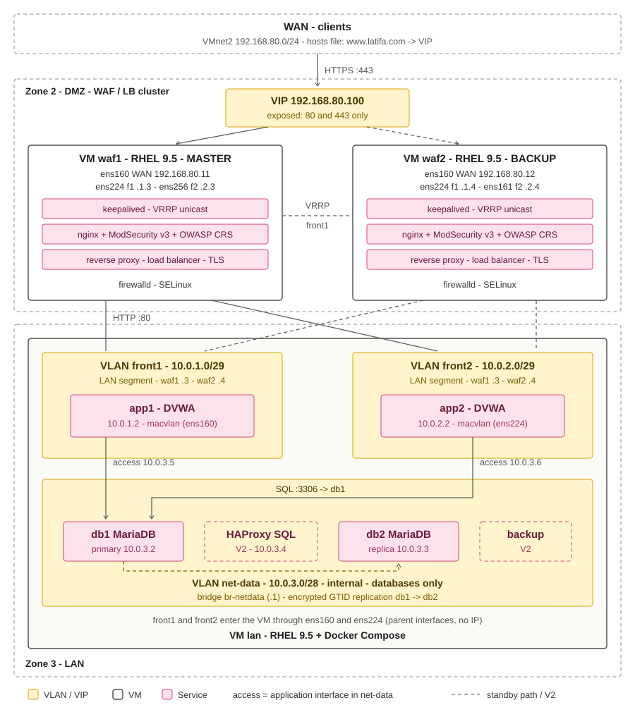

# High-Availability Web Application Behind an Open-Source WAF

Lab build of a highly available web application protected by nginx, ModSecurity and the OWASP Core Rule Set, with keepalived failover, on RHEL 9.5 and Docker Compose.

Documentation: [docs/00-index.md](docs/00-index.md)

## Status

Work in progress (V1): stages 01 to 10 completed and validated.

## Roadmap

- **V1:** WAF/LB cluster with virtual IP, two application instances, replicated database.
- **V2:** SQL proxy with automatic failover, backups, shared sessions.
- **V3:** Security monitoring (Wazuh) and centralised logging.
- **Automation:** Ansible playbooks to deploy the full lab.
